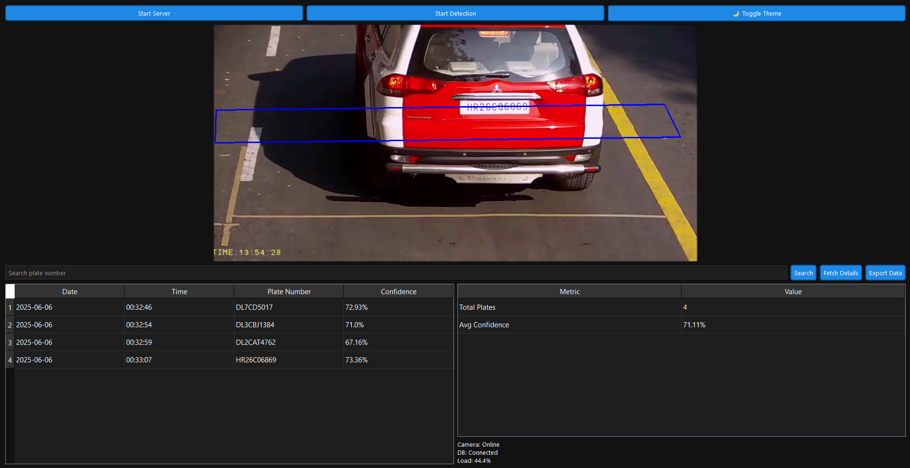

# Automatic Number Plate Detection

## Overview

This project is an **Automatic Number Plate Detection System** that utilizes **YOLOv8** for object detection and **PaddleOCR** for optical character recognition (OCR). Detected license plate numbers are sent to a **FastAPI** backend, which stores them in a **MySQL database** with timestamps.

### 🔍 New Feature: Desktop Application (GUI)

In addition to the CLI-based detection script (`main.py`), this project now includes a **modern desktop application** built using **PyQt5**, offering an interactive and visually enhanced interface for real-time detection, database search, and export functionality.

> 📸 **Screenshot:**
> 

---

## Features

* Real-time license plate detection using YOLOv8.
* OCR-based number plate recognition with PaddleOCR.
* FastAPI server for database storage (MySQL).
* Timestamps for every detected plate.
* Toggle between Light/Dark theme in the GUI.
* Live system status and detection summary.
* Search, filter, and export stored plate data.
* Environment variables for secure database configuration.

---

## Technologies Used

* **Python** (Core programming language)
* **OpenCV** (Image processing)
* **YOLOv8 (Ultralytics)** (License plate detection)
* **PaddleOCR** (Text recognition)
* **FastAPI** (Backend API for database storage)
* **MySQL** (Database for storing detected plates)
* **Uvicorn** (ASGI server for FastAPI)
* **Requests** (Sending data to the backend)
* **CVZone** (Visualization tools)
* **python-dotenv** (Environment variable management)
* **PyQt5** (Desktop GUI for detection dashboard)

---

## Installation

### Prerequisites

Ensure you have the following installed on your system:

* Python 3.x
* MySQL (Ensure MySQL is running and accessible)

### Setup Instructions

1. **Clone the Repository**

   ```bash
   git clone <repo_link>
   cd <repo_name>
   ```

2. **Install Required Dependencies**

   ```bash
   pip install -r requirements.txt
   ```

3. **Configure Environment Variables**
   Create a `.env` file in the root directory and add the following:

   ```env
   DB_HOST=127.0.0.1
   DB_USER=root
   DB_PASSWORD=your_mysql_password
   DB_NAME=numberplate
   DB_PORT=3306
   ```

   ⚠️ Replace `your_mysql_password` with your actual MySQL root password.

4. **Configure MySQL Database**

   * Ensure MySQL is running.
   * The database will be automatically created if it does not exist.
   * Modify `server.py` if you need to change database configurations.

---

## Running the Project

### Option 1: Command-line Detection

1. **Start the FastAPI Server**

   ```bash
   python server.py
   ```

2. **Run Detection via CLI**

   ```bash
   python main.py
   ```

### Option 2: GUI Desktop Application

1. **Run the PyQt5 App**

   ```bash
   python app.py
   ```

   * Click **"Start Server"** to launch the backend.
   * Click **"Start Detection"** to begin video analysis.
   * Use the search bar, theme toggle, and export options within the interface.

---

## API Endpoints

| Method | Endpoint        | Description                                          |
| ------ | --------------- | ---------------------------------------------------- |
| POST   | `/store_plate/` | Stores detected plate number in MySQL with timestamp |
| GET    | `/plates/`      | Retrieves all stored number plates                   |

---

## File Structure

```
├── main.py                   # CLI number plate detection & OCR
├── app.py                    # PyQt5 Desktop GUI Application
├── server.py                 # FastAPI backend for MySQL storage
├── .env                      # Environment variables (database credentials)
├── requirements.txt          # Required dependencies
├── license_plate_detector.pt # YOLOv8 model for plate detection
├── coco1.txt                 # Class names for YOLO model
├── sample/                   # Folder containing input video(s)
├── .gitignore                # Ignore __pycache__ and environment files
```

---

## Notes

* Modify `server.py` for custom database configurations.
* Ensure the `.env` file is properly configured before running the project.
* `main.py` and `app.py` both read video from `sample/sample#1.mp4`. Update the path if needed.

---

## License

This project is open-source and available under the **MIT License**.
